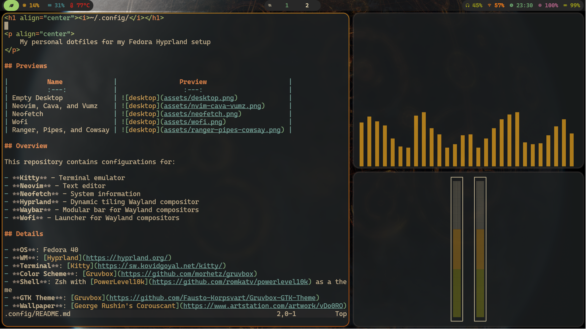
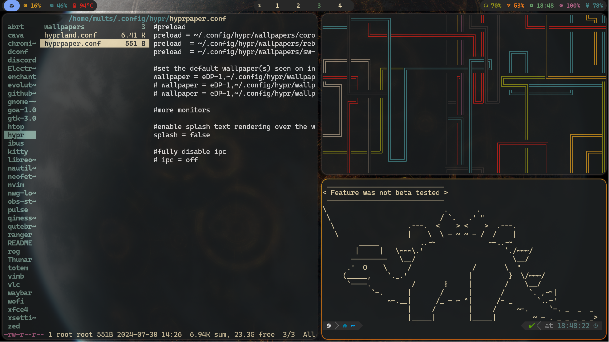

<h1 align="center"><i>home/mults/.config/</i></h1>

## Previews

|          Name             |                Preview                     |
|          :---:            |                 :---:                      |
| Empty Desktop             |              | 
| Neovim, Cava, and Vumz    |       | 
| Neofetch                  |             | 
| Wofi                      |                 | 
| Ranger, Pipes, and Cowsay |  | 

### Empty Desktop

    
     

### NeoVIM, Cava, and Vumz

    
     

### Neofetch

    
     

### Wofi

    
     

### Ranger, Pipes, and Cowsay

    
     

## Overview

This repository contains configurations for:

- **Kitty** - Terminal emulator
- **Neovim** - Text editor
- **Neofetch** - System information
- **Hyprland** - Dynamic tiling Wayland compositor
- **Waybar** - Modular bar for Wayland compositors
- **Wofi** - Launcher for Wayland compositors

## Details

- **OS**: Fedora 40
- **WM**: [Hyprland](https://hyprland.org/)
- **Terminal**: [Kitty](https://sw.kovidgoyal.net/kitty/)
- **Color Scheme**: [Gruvbox](https://github.com/morhetz/gruvbox)
- **Shell**: Zsh with [PowerLevel10k](https://github.com/romkatv/powerlevel10k) as a theme
- **GTK Theme**: [Gruvbox](https://github.com/Fausto-Korpsvart/Gruvbox-GTK-Theme)
- **Wallpaper**: [George Rushin's Corouscant][https://www.artstation.com/artwork/vDo0RO]

## Scripts displayed in the previews

- [**Cava**](https://github.com/karlstav/cava): Audio visualizer
- [**Neofetch**](https://github.com/dylanaraps/neofetch): System information
- [**Pipes.sh**](https://github.com/pipeseroni/pipes.sh): Animated pipes in the terminal
- [**Ranger**](https://github.com/ranger/ranger): A VIM-inspired file manager for the console 
- [**CMatrix**](https://github.com/abishekvashok/cmatrix): Matrix effect
- [**VUMZ**](https://github.com/IonelPopJara/vumz): A simple CLI VU meter made by me

